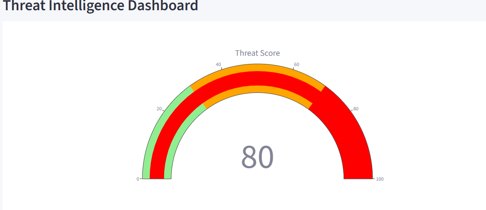
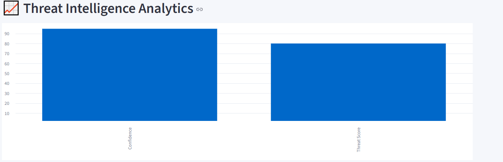
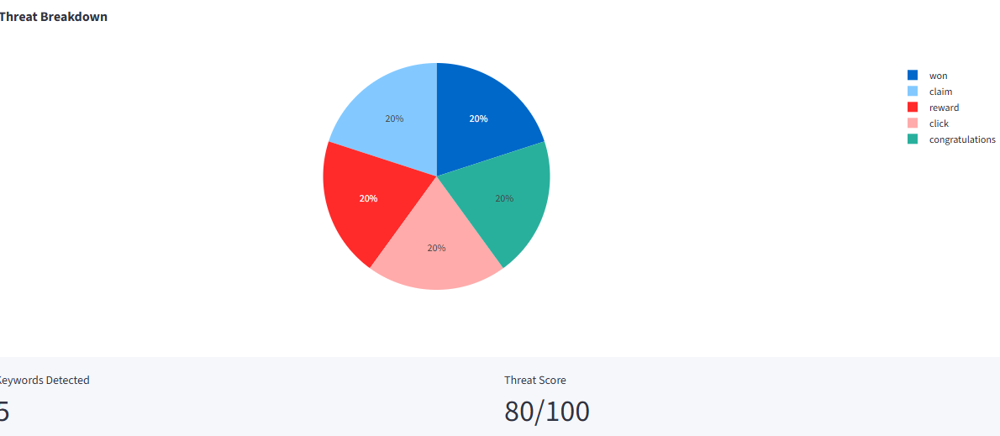
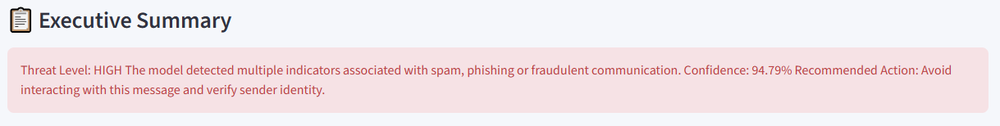

# 🛡️ MailShield Pro

## Threat Detection & Message Security Platform

MailShield Pro is an AI-powered cybersecurity application that analyzes emails, SMS messages, and text content to identify spam, phishing attempts, and suspicious communications.

The system combines Machine Learning with a Threat Intelligence Engine to provide real-time risk assessment and security recommendations.
## 🌐 Live Demo

👉 [Launch MailShield Pro](https://mailshield-ejaf2metpe3enk48ikzfrk.streamlit.app/)

---

## Features

* Spam Detection using Multinomial Naive Bayes
* Threat Score Calculation
* Confidence Score Prediction
* Threat Intelligence Dashboard
* Security Recommendations
* Executive Summary Generation
* Threat Breakdown Visualization
* File Upload Support
* Real-Time Message Analysis

---

## Technologies Used

* Python
* Streamlit
* Scikit-Learn
* Pandas
* Plotly
* Multinomial Naive Bayes

---

## Project Workflow

1. User enters or uploads a message.
2. Text is processed and transformed using the trained vectorizer.
3. Multinomial Naive Bayes predicts Spam or Safe.
4. Threat Intelligence Engine calculates risk score.
5. Dashboard displays:

   * Threat Score
   * Confidence Score
   * Threat Indicators
   * Threat Breakdown
   * Security Recommendation

---

## Screenshots

### Dashboard

### Threat Analysis

### Threat Breakdown

### Executive Summary

---

## Future Enhancements

* PDF Security Reports
* Email Header Analysis
* URL Reputation Checking
* Real-Time Threat Monitoring

---

## Developed By

Meenakshi Singanamala
